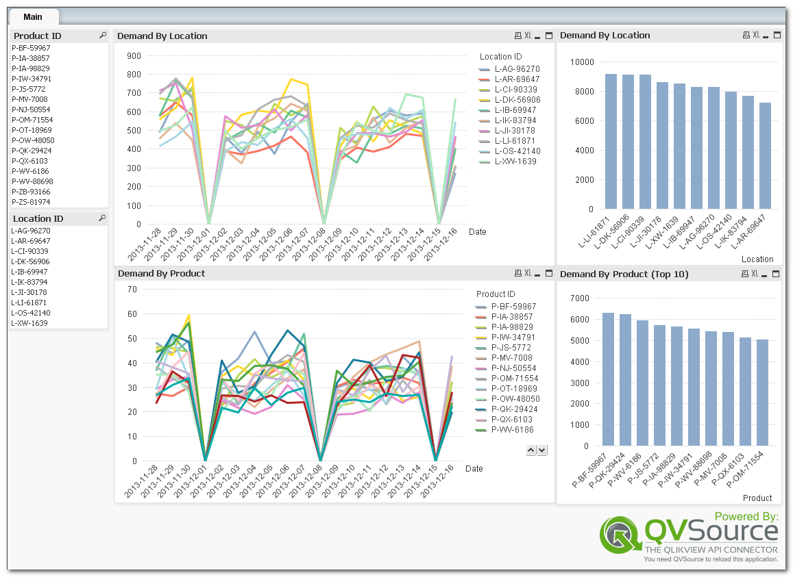

Blue Yonder Example App For QlikView
====================================
An example load script showing how to get started using the [QVSource Blue Yonder Connector](http://wiki.qvsource.com/Blue-Yonder-Connector-For-QlikView.ashx) for QlikView.

*Note that the [load script](https://github.com/QVSource/QVSource-Blue-Yonder-Example-For-QlikView/blob/master/QVSource-Blue-Yonder-Example-For-QlikView-prj/LoadScript.txt) should also work in Qlik Sense.*

If you are a QlikView + QVSource user you can simply click the ["Download ZIP"] (https://github.com/QVSource/QVSource-Blue-Yonder-Example-For-QlikView/archive/master.zip) button on GitHub to grab this application.

The content below is copied from the change log in the first tab of the load script.

IMPORTANT: In order to use this sample you will need to have:
* A username, password and tenant ID from Blue Yonder.
** These should be entered into the QVSource Blue Yonder Connector.
* A CSV file containing the list of location and product IDs (replace the txt file in the Data subdirectory).

Please see the notes in the load script for more details on this sample.

1.0.1 - 04/12/13
----------------
* Added badge.

1.0.0 - 28/11/13
----------------
* Initial Release
